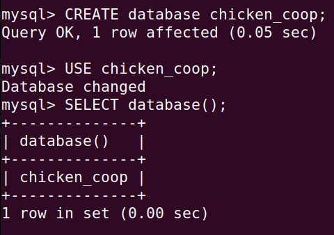
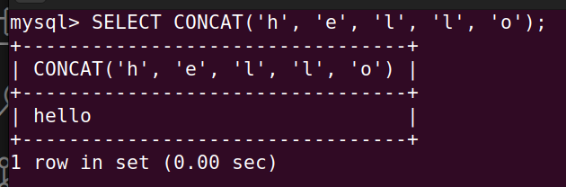
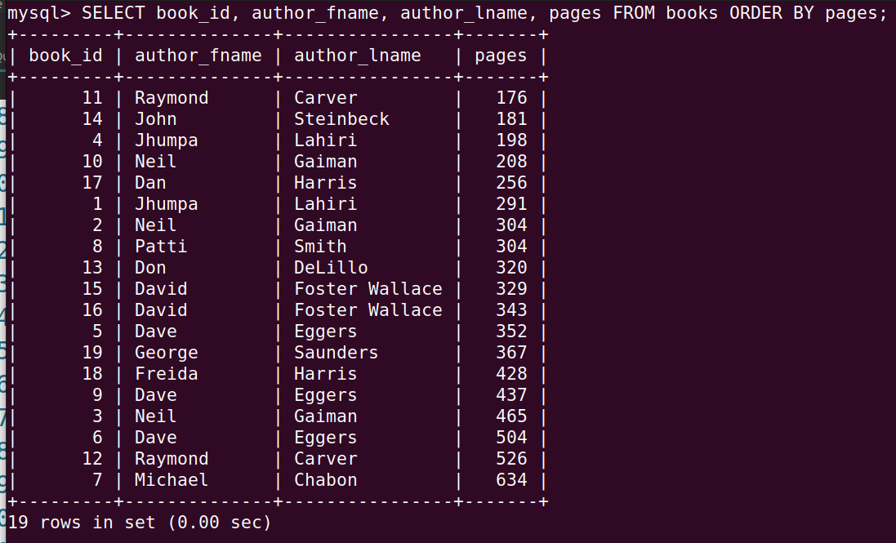
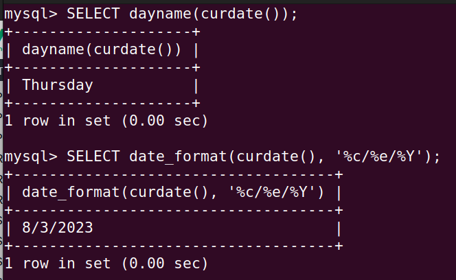
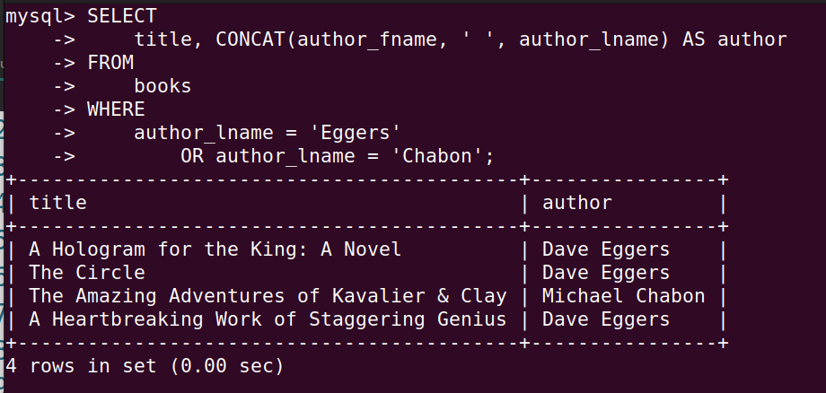
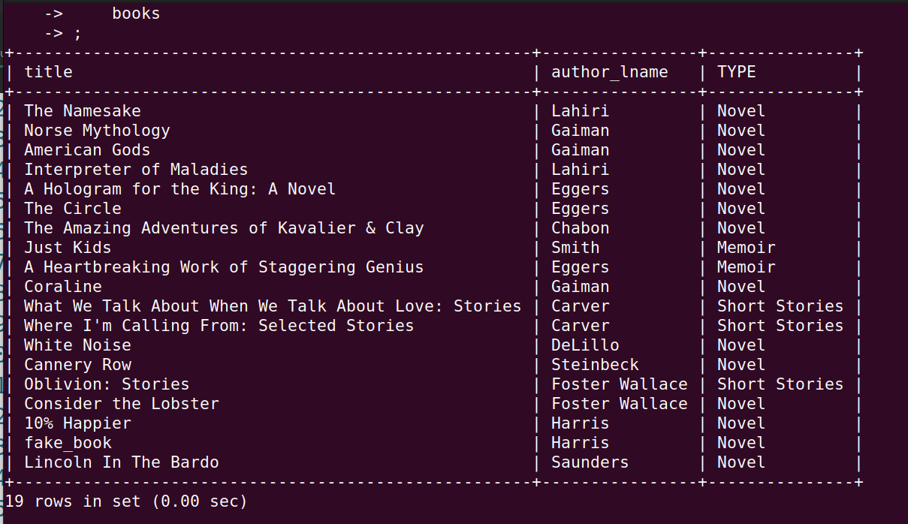
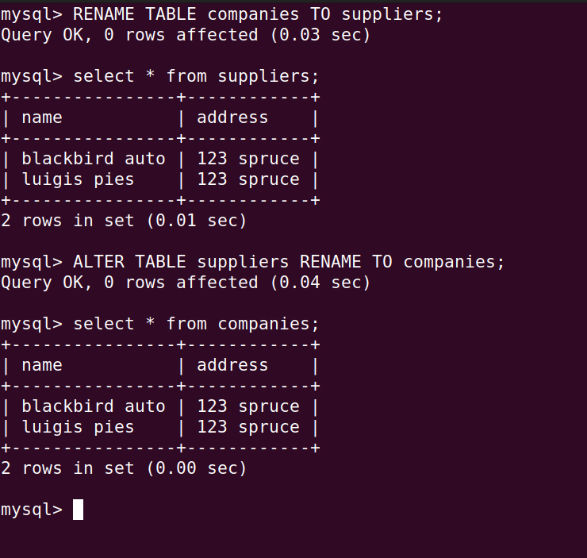
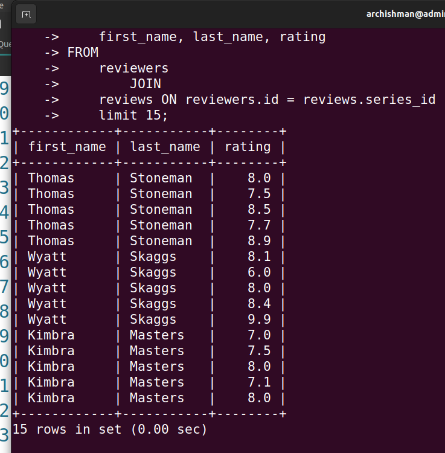

<h3>What is a Database?</h3>

- A collection of data.
- A method to access and manipulate the data.

> SQL is the language we use to talk to databases.
>
> There is a SQL standard implemented.

```sql

SHOW databases;

```


```sql
DROP database pet_shop;

```


```sql

CREATE database chicken_coop;
USE chicken_coop;
SELECT database();

```




* Table: A collection of related data held in a structured format within a database.

```sql

CREATE TABLE cats (
Cat_Name varchar(20),
Breed varchar(40),
Age int
);

DESC cats;

```


```sql

DROP TABLE cats;

```


```sql

INSERT INTO cats(name, age)
VALUES ('Jetson', 7);

```


```sql

INSERT INTO cats(Cat_Name, Age)
VALUES ('MeatBall', 5), ('Turkey', 1), ('Potato Face', 15);

```


```sql

create table cats2(
name varchar(100) not null,
age int not null);

```


> It's best to use a single quotation mark.
>
> If we want to use single quotes inside string, use escape sequence.

```sql

create table cats5(
id int primary key auto_increment,
name varchar(20),
age int);

```


```sql

INSERT into cats5(name, age)
values ('Boingo', 3);
INSERT into cats5(name, age)
values ('Boingo', 3);
INSERT into cats5(name, age)
values ('Boingo', 3);

```


```sql

CREATE TABLE Employees (
id int PRIMARY KEY auto_increment,
last_name varchar(20) NOT NULL,
first_name varchar(20) NOT NULL,
middle_name varchar(20),
age int NOT NULL,
current_status varchar(20) NOT NULL DEFAULT 'Employed');

```


```sql

INSERT INTO Employees (first_name, last_name, age)
VALUES ('Archishman', 'Ghosh', 23);
SELECT * from Employees;

```


```sql

SELECT name FROM cats;

```


```sql

SELECT * FROM cats WHERE age = 4;
SELECT name, age FROM cats WHERE age = 4;

```


```sql

SELECT cat_id, age FROM cats WHERE cat_id = age;

```


```sql
SELECT name AS Cat_Name, age AS Cat_Age FROM cats WHERE breed = 'Tabby';
```


* Update: UPDATE and SET are pairs.

```sql
UPDATE cats SET age = 14 WHERE name = 'Misty';
```


```sql
UPDATE cats SET name = 'Jack' WHERE name = 'Jackson';
UPDATE cats SET breed = 'Short Hair' WHERE name = 'Ringo';
UPDATE cats SET age = 12 WHERE breed = 'Maine Coon';
```


* Delete: DELETE and FROM are pairs. Delete empties out a table, but Drop deletes the whole table from memory.

```sql
DELETE FROM cats WHERE age = 4;
DELETE FROM cats WHERE cat_id = age;
DELETE FROM cats;
```


<h4>Shirts Exercise</h4>

```sql
CREATE DATABASE shirts_db;
USE shirts_db;
CREATE TABLE shirts(
shirt_id int PRIMARY KEY AUTO_INCREMENT,
article varchar(40),
color varchar(30),
shirt_size varchar(10),
last_worn int);
```


```sql
INSERT INTO shirts(article, color, shirt_size, last_worn)
VALUES ('t-shirt', 'white', 'S', 10),
	('t-shirt', 'green', 'S', 200),
	('polo shirt', 'black', 'M', 10),
	('tank top', 'blue', 'S', 50),
	('t-shirt', 'pink', 'S', 0),
	('polo shirt', 'red', 'M', 5),
	('tank top', 'white', 'S', 200),
	('tank top', 'blue', 'M', 15);
SELECT * FROM shirts;
```


```sql
INSERT INTO shirts(article, color, shirt_size, last_worn)
VALUES ('polo shirt', 'purple', 'M', 50);
```


```sql
SELECT article, color FROM shirts;
```


```sql
SELECT article, color, shirt_size, last_worn FROM shirts WHERE shirt_size = 'M';
```


```sql
UPDATE shirts SET shirt_size = 'L' WHERE article = 'polo shirt';
```


```sql
UPDATE shirts SET last_worn = 0 WHERE last_worn = 15;
```


```sql
UPDATE shirts SET shirt_size = 'XS', color = 'off white' WHERE color = 'white';
```


```sql
DELETE FROM shirts WHERE last_worn = 200;
```


```sql
DELETE FROM shirts WHERE article = 'tank top';
```


```sql
DELETE FROM shirts;
DROP TABLE shirts;
```


```sql
CREATE TABLE books (
		book_id INT NOT NULL AUTO_INCREMENT,
		title VARCHAR(100),
		author_fname VARCHAR(100),
		author_lname VARCHAR(100),
		released_year INT,
		stock_quantity INT,
		pages INT,
		PRIMARY KEY(book_id)
);

INSERT INTO books (title, author_fname, author_lname, released_year, stock_quantity, pages)
VALUES
('The Namesake', 'Jhumpa', 'Lahiri', 2003, 32, 291),
('Norse Mythology', 'Neil', 'Gaiman',2016, 43, 304),
('American Gods', 'Neil', 'Gaiman', 2001, 12, 465),
('Interpreter of Maladies', 'Jhumpa', 'Lahiri', 1996, 97, 198),
('A Hologram for the King: A Novel', 'Dave', 'Eggers', 2012, 154, 352),
('The Circle', 'Dave', 'Eggers', 2013, 26, 504),
('The Amazing Adventures of Kavalier & Clay', 'Michael', 'Chabon', 2000, 68, 634),
('Just Kids', 'Patti', 'Smith', 2010, 55, 304),
('A Heartbreaking Work of Staggering Genius', 'Dave', 'Eggers', 2001, 104, 437),
('Coraline', 'Neil', 'Gaiman', 2003, 100, 208),
('What We Talk About When We Talk About Love: Stories', 'Raymond', 'Carver', 1981, 23, 176),
("Where I'm Calling From: Selected Stories", 'Raymond', 'Carver', 1989, 12, 526),
('White Noise', 'Don', 'DeLillo', 1985, 49, 320),
('Cannery Row', 'John', 'Steinbeck', 1945, 95, 181),
('Oblivion: Stories', 'David', 'Foster Wallace', 2004, 172, 329),
('Consider the Lobster', 'David', 'Foster Wallace', 2005, 92, 343);
```


```sql
SELECT CONCAT('h', 'e', 'l', 'l', 'o');
```



```sql
SELECT CONCAT (author_fname, ' ', author_lname, '!') AS Author_Name FROM books;
```


```sql
SELECT CONCAT_WS (' - ', title, author_fname, author_lname) AS Author_Name FROM books;
```


```sql
SELECT SUBSTRING('HelloWorld', 1, 4);
```


```sql
SELECT SUBSTRING('HelloWorld', 5);
```


```sql
SELECT SUBSTRING('HelloWorld', -5);
```


```sql
SELECT SUBSTR(title, 1, 7) AS new_title FROM books;
```


```sql
SELECT CONCAT(SUBSTR(title, 1, 10), '...') AS shortened_title FROM books;
```


```sql
SELECT REPLACE('Hello World', 'Hell', '%$#@');
```


```sql
SELECT REPLACE(title, ' ', ' - ') FROM books;
```


```sql
SELECT REVERSE(title) FROM books;
```


```sql
SELECT CHAR_LENGTH(title) as title_length FROM books;
```


* Charlength() gives us the character length while length() returns the bytes.

```sql
SELECT UPPER(title) AS title_upper FROM books;
```


```sql
SELECT CONCAT('I LOVE ', UCASE(title), ' !!!') FROM books;
```


```sql
SELECT INSERT('Hello World', 6, 0, ' There');
SELECT INSERT('Hello World', 6, 4, ' There');
```


```sql
SELECT LEFT('Foobar', 4);
```

```sql
SELECT LEFT('Foobar', 4);
SELECT RIGHT('Foobar', 4);
```


```sql
SELECT REPEAT('ha', 4);
SELECT TRIM('      Hello   World    ');
SELECT TRIM(LEADING '.' FROM '......Hello   World....');
SELECT TRIM(TRAILING '.' FROM '......Hello   World....');
SELECT TRIM(BOTH '.' FROM '......Hello   World....');
```


```sql
SELECT DISTINCT author_lname FROM books;
SELECT DISTINCT released_year FROM books;

SELECT DISTINCT CONCAT(author_fname, ' ', author_lname) FROM books;
SELECT DISTINCT author_fname, author_lname FROM books;
```


```sql
SELECT book_id, author_fname, author_lname FROM books;
SELECT book_id, author_fname, author_lname FROM books ORDER BY author_lname;
SELECT book_id, author_fname, author_lname FROM books ORDER BY author_lname DESC;
SELECT book_id, author_fname, author_lname, pages FROM books ORDER BY pages;
SELECT book_id, author_fname, author_lname, pages, released_year FROM books ORDER BY released_year;
```





```sql
SELECT book_id, author_fname, author_lname, pages FROM books ORDER BY 4;
SELECT book_id, author_fname, author_lname, released_year FROM books ORDER BY author_lname, released_year;
SELECT book_id, author_fname, author_lname, released_year FROM books ORDER BY author_lname DESC, released_year;
SELECT CONCAT(author_fname, ' ', author_lname) AS author FROM books ORDER BY author;
```


```sql
SELECT book_id, author_fname, author_lname, released_year FROM books ORDER BY released_year LIMIT 5;
SELECT book_id, author_fname, author_lname, released_year FROM books ORDER BY released_year LIMIT 2, 5;
```


```sql
SELECT book_id, author_fname, author_lname, pages FROM books WHERE author_fname LIKE '%da%';
SELECT title, author_fname, author_lname, pages FROM books WHERE title LIKE '%:%';
SELECT title, author_fname, author_lname, released_year FROM books WHERE released_year LIKE '1___';
SELECT title, author_fname, author_lname, released_year FROM books WHERE author_fname LIKE '%n';
```


```sql
SELECT title FROM books WHERE title LIKE '%stories%';
SELECT title, pages FROM books ORDER BY pages DESC LIMIT 1;
SELECT CONCAT(title, ' - ', released_year) AS summary FROM books ORDER BY released_year DESC LIMIT 3;
SELECT title, author_lname FROM books WHERE author_lname LIKE '% %';
SELECT title, released_year, stock_quantity FROM books ORDER BY stock_quantity LIMIT 3;
SELECT title, author_lname FROM books ORDER BY author_lname, title;
SELECT UCASE(CONCAT('MY FAVOURITE AUTHOR IS ', author_fname, ' ', author_lname, ' !')) AS yell FROM books ORDER BY author_lname;
```


```sql
SELECT COUNT(*) FROM books;
SELECT COUNT(DISTINCT author_fname) FROM books;
SELECT COUNT(DISTINCT released_year) FROM books;
SELECT COUNT(DISTINCT author_lname) FROM books;
SELECT COUNT(*) FROM books WHERE title LIKE '%The%';
```


```sql
SELECT author_lname FROM books GROUP BY author_lname;
SELECT author_lname, COUNT(*) FROM books GROUP BY author_lname;
SELECT author_lname, COUNT(*) AS books_written FROM books GROUP BY author_lname ORDER BY books_written DESC;
SELECT author_fname, author_lname, COUNT(*) FROM books GROUP BY author_fname, author_lname;
```


```sql
SELECT MIN(released_year) FROM books;
SELECT MAX(pages) FROM books;
SELECT title, pages FROM books WHERE pages = (SELECT MAX(pages) FROM books);
SELECT title, released_year FROM books WHERE released_year = (SELECT MIN(released_year) FROM books);
```


```sql
SELECT 
    CONCAT(author_fname, ' ', author_lname) AS author,
    COUNT(*) AS no_of_books,
    MIN(released_year) AS first_book,
    MAX(released_year) AS last_book
FROM
    books
GROUP BY author_fname , author_lname;
```


```sql
SELECT SUM(pages) FROM books;
SELECT 
    CONCAT(author_fname, ' ', author_lname) AS author,
    SUM(pages)
FROM
    books
GROUP BY author;
```


```sql
SELECT AVG(released_year) FROM books;
SELECT AVG(pages) FROM books;
SELECT AVG(stock_quantity) FROM books;
SELECT released_year, AVG(stock_quantity) FROM books GROUP BY released_year;
```


```sql
SELECT COUNT(title) FROM books;
SELECT released_year, COUNT(*) AS book_count FROM books GROUP BY released_year;
SELECT SUM(stock_quantity) AS total_books FROM books;
SELECT 
    CONCAT(author_fname, ' ', author_lname) AS author,
    AVG(released_year) AS avg_release
FROM
    books
GROUP BY author;
SELECT 
    CONCAT(author_fname, ' ', author_lname) AS author, pages
FROM
    books
WHERE
    pages = (SELECT 
            MAX(pages)
        FROM
            books);


SELECT 
    released_year AS year,
    COUNT(*) AS no_books,
    AVG(pages) AS avg_pages
FROM
    books
GROUP BY released_year
ORDER BY released_year;
```


```sql
CREATE TABLE people (
    name VARCHAR(40),
    birth_date DATE,
    birth_time TIME,
    birth_dt DATETIME
);

INSERT INTO people(name, birth_date, birth_time, birth_dt)
VALUES ('Elton', '2000-12-25', '20:32:55', '2000-12-25 20:32:55');

INSERT INTO people(name, birth_date, birth_time, birth_dt)
VALUES ('Loo Loo', '1985-04-11', '9:21:33', '1985-04-11 9:21:33'),('Huan', '2020-06-12', '22:59:12', '2020-06-12 22:59:12');

INSERT INTO people(name, birth_date, birth_time, birth_dt)
VALUES ('Archi', CURDATE(), CURTIME(), NOW());

SELECT DAY(birth_date), DAYOFWEEK(birth_date), DAYOFYEAR(birth_date), birth_date FROM people;

SELECT birth_date, DAY(birth_date), DAYOFWEEK(birth_date), MONTHNAME(birth_date) FROM people;

SELECT name, birth_dt, year(birth_dt), monthname(birth_dt) from people;
```


```sql
SELECT 
    name,
    birth_time,
    HOUR(birth_time),
    MINUTE(birth_time),
    SECOND(birth_time)
FROM
    people;

SELECT 
    name, birth_time, DATE(birth_dt), TIME(birth_dt)
FROM
    people;

SELECT 
    birth_date, DATE_FORMAT(birth_date, '%a, %D %b')
FROM
    people;
    
SELECT 
    birth_dt, TIME_FORMAT(birth_dt, '%h:%i')
FROM
    people;
```


```sql
SELECT 
    birth_dt, DATEDIFF(CURDATE(), birth_dt)
FROM
    people;


SELECT 
    birth_dt, date_add(birth_dt, interval 18 year)
FROM
    people;

SELECT 
    curdate(), date_sub(curdate(), interval 18 year)
FROM
    people;
```


```sql
SELECT CURTIME();
SELECT CURDATE();
SELECT DAYOFWEEK(CURDATE());
SELECT DAYNAME(CURDATE());
SELECT DATE_FORMAT(CURDATE(), '%c/%e/%Y');
SELECT DATE_FORMAT(NOW(), '%M %D at %h:%i');

CREATE TABLE tweets (
    content VARCHAR(180),
    username VARCHAR(40),
    created_time TIMESTAMP DEFAULT CURRENT_TIMESTAMP
);
```





```sql
SELECT 
    title,
    released_year,
    CASE
        WHEN released_year >= 2000 THEN 'Modern Lit'
        ELSE '20th Century lit'
    END AS genre
FROM
    books;

SELECT 
    title,
    stock_quantity,
    CASE
        WHEN stock_quantity <= 50 THEN '*'
        WHEN stock_quantity <= 100 THEN '**'
        ELSE '***'
    END AS stock
FROM
    books;
```


```sql
SELECT 
    title, released_year
FROM
    books
WHERE
    released_year < 1980;


SELECT 
    title, CONCAT(author_fname, ' ', author_lname) AS author
FROM
    books
WHERE
    author_lname = 'Eggers'
        OR author_lname = 'Chabon';


SELECT 
    title, author_lname, released_year
FROM
    books
WHERE
    author_lname = 'Lahiri'
        AND released_year > 2000;

SELECT 
    title,
    CONCAT(author_fname, ' ', author_lname) AS author,
    released_year,
    pages
FROM
    books
WHERE
    pages BETWEEN 100 AND 200;

SELECT 
    title, author_lname
FROM
    books
WHERE
    author_lname LIKE 'C%'
        OR author_lname LIKE 'S%';

SELECT 
    title,
    author_lname,
    CASE
        WHEN title LIKE '%stories%' THEN 'Short Stories'
        WHEN
            title LIKE '%Just Kids%'
                OR title LIKE '%A Heartbreaking Work%'
        THEN
            'Memoir'
        ELSE 'Novel'
    END AS TYPE
FROM
    books;
    
SELECT 
    author_fname,
    author_lname,
    CASE
        WHEN COUNT(*) = 1 THEN '1 book'
        ELSE CONCAT(COUNT(*), ' books')
    END AS COUNT
FROM
    books
GROUP BY author_fname , author_lname;
```








* CHECK constraint.

```sql
name varchar(20),
address varchar(20),
age INT,
CONSTRAINT age_over_18 CHECK(age > 18)
CONSTRAINT name_address UNIQUE(name, address);
```

```sql
CREATE TABLE companies (
    name VARCHAR(200) NOT NULL,
    address VARCHAR(200) NOT NULL,
    CONSTRAINT name_add UNIQUE (name , address)
);

INSERT INTO companies(name, address) 
VALUES ('blackbird auto', '123 spruce'), ('luigis pies', '123 spruce');
    
ALTER TABLE companies
ADD COLUMN phone char(10);
    
ALTER TABLE companies
DROP COLUMN phone;

RENAME TABLE companies TO suppliers;
ALTER TABLE suppliers RENAME TO companies;
    
ALTER TABLE companies RENAME COLUMN name TO company_name;
```





```sql
ALTER TABLE companies
MODIFY company_name varchar(100) DEFAULT 'Unknown';

ALTER TABLE companies
CHANGE company_name name varchar(100) DEFAULT 'Unknown';
    
ALTER TABLE companies ADD CONSTRAINT name_length_10 CHECK (CHAR_LENGTH(name) >= 10);    
ALTER TABLE companies DROP CONSTRAINT name_length_10;
```


```sql
CREATE TABLE customers (
    customer_id INT PRIMARY KEY AUTO_INCREMENT,
    first_name VARCHAR(30),
    last_name VARCHAR(30),
    email VARCHAR(30)
);

CREATE TABLE orders (
    order_id INT PRIMARY KEY AUTO_INCREMENT,
    order_date DATE,
    amount DECIMAL(8 , 2 ),
    customer_id INT,
    FOREIGN KEY(customer_id) references customers(customer_id)
);
    
INSERT INTO customers (first_name, last_name, email) 
VALUES ('Boy', 'George', 'george@gmail.com'),
       ('George', 'Michael', 'gm@gmail.com'),
       ('David', 'Bowie', 'david@gmail.com'),
       ('Blue', 'Steele', 'blue@gmail.com'),
       ('Bette', 'Davis', 'bette@aol.com');

INSERT INTO orders (order_date, amount, customer_id)
VALUES ('2016-02-10', 99.99, 1),
       ('2017-11-11', 35.50, 1),
       ('2014-12-12', 800.67, 2),
       ('2015-01-03', 12.50, 2),
       ('1999-04-11', 450.25, 5);
```


```sql
SELECT 
    *
FROM
    orders
WHERE
    customer_id = (SELECT 
            customer_id
        FROM
            customers
        WHERE
            first_name = 'Boy'
                AND last_name = 'George');

SELECT 
    *
FROM
    customers,
    orders;
```


```sql
SELECT 
    *
FROM
    customers
        JOIN
    orders ON customers.customer_id = orders.customer_id;


SELECT 
    first_name, last_name, order_date, amount
FROM
    customers
        JOIN
    orders ON customers.customer_id = orders.customer_id;


SELECT 
    first_name, last_name, SUM(amount) AS total_amount
FROM
    customers
        JOIN
    orders ON customers.customer_id = orders.customer_id
GROUP BY first_name , last_name
ORDER BY total_amount DESC;
```


```sql
SELECT 
    first_name, last_name, order_date, amount
FROM
    customers
        LEFT JOIN
    orders ON customers.customer_id = orders.customer_id;

SELECT 
    first_name, last_name, IFNULL(SUM(amount), 0) AS money_spent
FROM
    customers
        LEFT JOIN
    orders ON customers.customer_id = orders.customer_id
GROUP BY first_name , last_name;
```


```sql
SELECT 
    first_name, last_name, order_date, amount
FROM
    customers
        RIGHT JOIN
    orders ON customers.customer_id = orders.customer_id;
    
CREATE TABLE customers (
    customer_id INT PRIMARY KEY AUTO_INCREMENT,
    first_name VARCHAR(30),
    last_name VARCHAR(30),
    email VARCHAR(30)
);

CREATE TABLE orders (
    order_id INT PRIMARY KEY AUTO_INCREMENT,
    order_date DATE,
    amount DECIMAL(8 , 2 ),
    customer_id INT,
    FOREIGN KEY (customer_id)
        REFERENCES customers (customer_id)
        ON DELETE CASCADE
);
    
INSERT INTO customers (first_name, last_name, email) 
VALUES ('Boy', 'George', 'george@gmail.com'),
       ('George', 'Michael', 'gm@gmail.com'),
       ('David', 'Bowie', 'david@gmail.com'),
       ('Blue', 'Steele', 'blue@gmail.com'),
       ('Bette', 'Davis', 'bette@aol.com');

INSERT INTO orders (order_date, amount, customer_id)
VALUES ('2016-02-10', 99.99, 1),
       ('2017-11-11', 35.50, 1),
       ('2014-12-12', 800.67, 2),
       ('2015-01-03', 12.50, 2),
       ('1999-04-11', 450.25, 5);

select * from orders;
delete from customers where last_name='george';
```


```sql
CREATE TABLE students (
    id INT PRIMARY KEY AUTO_INCREMENT,
    first_name VARCHAR(20)
);

CREATE TABLE papers (
    title VARCHAR(40),
    grade CHAR(2),
    student_id INT,
    FOREIGN KEY (student_id)
        REFERENCES students (id)
);

ALTER TABLE papers 
MODIFY grade INT;

INSERT INTO students (first_name) VALUES
('Caleb'), ('Samantha'), ('Raj'), ('Carlos'), ('Lisa');

INSERT INTO papers (student_id, title, grade ) VALUES
(1, 'My First Book Report', 60),
(1, 'My Second Book Report', 75),
(2, 'Russian Lit Through The Ages', 94),
(2, 'De Montaigne and The Art of The Essay', 98),
(4, 'Borges and Magical Realism', 89);

SELECT 
    first_name, title, grade
FROM
    students
        JOIN
    papers ON students.id = papers.student_id
ORDER BY grade DESC;

SELECT 
    first_name, title, grade
FROM
    students
        LEFT JOIN
    papers ON students.id = papers.student_id;

SELECT 
    first_name,
    IFNULL(title, 'MISSING') AS title,
    IFNULL(grade, 0) AS grade
FROM
    students
        LEFT JOIN
    papers ON students.id = papers.student_id;

SELECT 
    first_name, AVG(IFNULL(grade, 0)) AS average
FROM
    students
        LEFT JOIN
    papers ON students.id = papers.student_id
GROUP BY first_name
ORDER BY average DESC;

SELECT 
    first_name,
    AVG(IFNULL(grade, 0)) AS average,
    CASE
        WHEN AVG(IFNULL(grade, 0)) >= 75 THEN 'PASSING'
        ELSE 'FAILING'
    END AS passing_status
FROM
    students
        LEFT JOIN
    papers ON students.id = papers.student_id
GROUP BY first_name
ORDER BY average DESC;
```


```sql
CREATE TABLE reviewers (
    id INT PRIMARY KEY AUTO_INCREMENT,
    first_name VARCHAR(50) NOT NULL,
    last_name VARCHAR(50) NOT NULL
);

CREATE TABLE series (
    id INT PRIMARY KEY AUTO_INCREMENT,
    title VARCHAR(100),
    released_year YEAR,
    genre VARCHAR(100)
);

CREATE TABLE reviews (
    id INT PRIMARY KEY AUTO_INCREMENT,
    rating DECIMAL(2 , 1 ) NOT NULL,
    reviewer_id INT,
    series_id INT,
    FOREIGN KEY (reviewer_id)
        REFERENCES reviewers (id),
    FOREIGN KEY (series_id)
        REFERENCES series (id)
);

DESC reviewers;
DESC series;
DESC reviews;

INSERT INTO series (title, released_year, genre) VALUES
    ('Archer', 2009, 'Animation'),
    ('Arrested Development', 2003, 'Comedy'),
    ("Bob's Burgers", 2011, 'Animation'),
    ('Bojack Horseman', 2014, 'Animation'),
    ("Breaking Bad", 2008, 'Drama'),
    ('Curb Your Enthusiasm', 2000, 'Comedy'),
    ("Fargo", 2014, 'Drama'),
    ('Freaks and Geeks', 1999, 'Comedy'),
    ('General Hospital', 1963, 'Drama'),
    ('Halt and Catch Fire', 2014, 'Drama'),
    ('Malcolm In The Middle', 2000, 'Comedy'),
    ('Pushing Daisies', 2007, 'Comedy'),
    ('Seinfeld', 1989, 'Comedy'),
    ('Stranger Things', 2016, 'Drama');

INSERT INTO reviewers (first_name, last_name) VALUES
    ('Thomas', 'Stoneman'),
    ('Wyatt', 'Skaggs'),
    ('Kimbra', 'Masters'),
    ('Domingo', 'Cortes'),
    ('Colt', 'Steele'),
    ('Pinkie', 'Petit'),
    ('Marlon', 'Crafford');
    
INSERT INTO reviews(series_id, reviewer_id, rating) VALUES
    (1,1,8.0),(1,2,7.5),(1,3,8.5),(1,4,7.7),(1,5,8.9),
    (2,1,8.1),(2,4,6.0),(2,3,8.0),(2,6,8.4),(2,5,9.9),
    (3,1,7.0),(3,6,7.5),(3,4,8.0),(3,3,7.1),(3,5,8.0),
    (4,1,7.5),(4,3,7.8),(4,4,8.3),(4,2,7.6),(4,5,8.5),
    (5,1,9.5),(5,3,9.0),(5,4,9.1),(5,2,9.3),(5,5,9.9),
    (6,2,6.5),(6,3,7.8),(6,4,8.8),(6,2,8.4),(6,5,9.1),
    (7,2,9.1),(7,5,9.7),
    (8,4,8.5),(8,2,7.8),(8,6,8.8),(8,5,9.3),
    (9,2,5.5),(9,3,6.8),(9,4,5.8),(9,6,4.3),(9,5,4.5),
    (10,5,9.9),
    (13,3,8.0),(13,4,7.2),
    (14,2,8.5),(14,3,8.9),(14,4,8.9);
```


```sql
SELECT 
    title, rating
FROM
    series
        JOIN
    reviews ON series.id = reviews.series_id;


SELECT 
    title, ROUND(AVG(rating), 2) AS avg_rating
FROM
    series
        JOIN
    reviews ON series.id = reviews.series_id
GROUP BY title
ORDER BY avg_rating;


SELECT 
    first_name, last_name, rating
FROM
    reviewers
        JOIN
    reviews ON reviewers.id = reviews.series_id
LIMIT 15;


SELECT 
    title AS unreviewed_series
FROM
    series
        LEFT JOIN
    reviews ON series.id = reviews.series_id
WHERE
    rating IS NULL;

SELECT 
    genre, AVG(rating) AS avg_rating
FROM
    series
        JOIN
    reviews ON series.id = reviews.series_id
GROUP BY genre;

SELECT 
    first_name,
    last_name,
    IFNULL(COUNT(reviews.id), 0) AS COUNT,
    MIN(IFNULL(rating, 0)) AS MIN,
    MAX(IFNULL(rating, 0)) AS MAX,
    AVG(IFNULL(rating, 0)) AS AVG,
    CASE
        WHEN IFNULL(COUNT(reviews.id), 0) = 0 THEN 'INACTIVE'
        ELSE 'ACTIVE'
    END AS STATUS
FROM
    reviewers
        LEFT JOIN
    reviews ON reviewers.id = reviews.reviewer_id
GROUP BY first_name , last_name;

SELECT 
    title,
    rating,
    CONCAT(first_name, ' ', last_name) AS reviewer
FROM
    series
        JOIN
    reviews ON series.id = reviews.series_id
        JOIN
    reviewers ON reviewers.id = reviews.reviewer_id
ORDER BY title;
```





```sql
SELECT 
    CONCAT(first_name, ' ', last_name) AS name,
    title,
    rating,
    released_year,
    genre
FROM
    reviewers
        JOIN
    reviews ON reviews.reviewer_id = reviewers.id
        JOIN
    series ON reviews.series_id = series.id;

CREATE VIEW review_details AS
    SELECT 
        CONCAT(first_name, ' ', last_name) AS name,
        title,
        rating,
        released_year,
        genre
    FROM
        reviewers
            JOIN
        reviews ON reviews.reviewer_id = reviewers.id
            JOIN
        series ON reviews.series_id = series.id;

SELECT 
    genre, AVG(rating) AS avg_rating
FROM
    review_details
GROUP BY genre;

CREATE VIEW ordered_series AS
SELECT * FROM series ORDER BY released_year;

CREATE OR REPLACE VIEW ordered_series AS
SELECT * FROM series ORDER BY released_year DESC;
 
ALTER VIEW ordered_series AS
SELECT * FROM series ORDER BY released_year;
 
DROP VIEW ordered_series;
```


```sql
SELECT 
    title, AVG(rating), COUNT(*) AS review_count
FROM
    review_details
GROUP BY title
HAVING COUNT(*) > 1;

SELECT 
    title, AVG(rating), COUNT(*) AS review_count
FROM
    review_details
GROUP BY title WITH ROLLUP
HAVING COUNT(*) > 1;

SELECT 
    released_year, genre, AVG(rating)
FROM
    review_details
GROUP BY released_year , genre WITH ROLLUP;
```


```sql
SELECT @@GLOBAL .sql_mode;
SELECT @@SESSION .sql_mode;
set session sql_mode='ONLY_FULL_GROUP_BY,STRICT_TRANS_TABLES,NO_ZERO_IN_DATE,NO_ZERO_DATE,NO_ENGINE_SUBSTITUTION';
```


```sql
CREATE TABLE employees (
    emp_no INT PRIMARY KEY AUTO_INCREMENT,
    department VARCHAR(20),
    salary INT
);

INSERT INTO employees (department, salary) VALUES
('engineering', 80000),
('engineering', 69000),
('engineering', 70000),
('engineering', 103000),
('engineering', 67000),
('engineering', 89000),
('engineering', 91000),
('sales', 59000),
('sales', 70000),
('sales', 159000),
('sales', 72000),
('sales', 60000),
('sales', 61000),
('sales', 61000),
('customer service', 38000),
('customer service', 45000),
('customer service', 61000),
('customer service', 40000),
('customer service', 31000),
('customer service', 56000),
('customer service', 55000);

SELECT AVG(salary) OVER() FROM employees;
SELECT emp_no, department, salary, AVG(salary) OVER() FROM employees;

SELECT emp_no, department, salary, AVG(salary)
OVER(PARTITION BY department) AS department_average FROM employees;

SELECT emp_no, department, salary, COUNT(*)
OVER(PARTITION BY department) AS department_count FROM employees;

SELECT emp_no, department, salary, 
SUM(salary) OVER(PARTITION BY department) AS department_payroll,
SUM(salary) OVER() AS company_payroll
FROM employees;

SELECT 
	emp_no, 
    department, 
    salary, 
	SUM(salary) OVER(PARTITION BY department ORDER BY salary) AS rolling_department_salary
FROM employees;

SELECT 
	emp_no, 
    department, 
    salary, 
    MIN(salary) OVER(PARTITION BY department ORDER BY salary DESC) AS rolling_min
FROM employees;

SELECT 
	emp_no, 
    department, 
    salary, 
    ROW_NUMBER() OVER(PARTITION BY department ORDER BY salary DESC) as rownumber,
    RANK() OVER(PARTITION BY department ORDER BY salary DESC) as department_salary_rank,
    RANK() OVER(ORDER BY salary DESC) as overall_rank,
    DENSE_RANK() OVER(ORDER BY salary DESC) as overall_dense_rank
FROM employees
ORDER BY overall_rank;


SELECT 
	emp_no, 
    department, 
    salary, 
    NTILE(4) OVER(ORDER BY salary DESC) AS salary_quartile
FROM employees;

SELECT 
	emp_no, 
    department, 
    salary, 
    FIRST_VALUE(emp_no) OVER(ORDER BY salary DESC) AS highest_salary_id
FROM employees;

SELECT 
	emp_no, 
    department, 
    salary, 
    FIRST_VALUE(emp_no) OVER(PARTITION BY department ORDER BY salary DESC) AS dept_highest_salary_id,
    FIRST_VALUE(emp_no) OVER(ORDER BY salary DESC) AS highest_salary_id
FROM employees;

SELECT 
	emp_no, 
    department, 
    salary, 
    NTH_VALUE(emp_no, 2) OVER(PARTITION BY department ORDER BY salary DESC) AS dept_secondhighest_salary_id,
    FIRST_VALUE(emp_no) OVER(ORDER BY salary DESC) AS highest_salary_id
FROM employees;


SELECT 
	emp_no, 
    department, 
    salary, 
    LAG(salary) OVER(ORDER BY salary DESC)
FROM employees;

SELECT 
	emp_no, 
    department, 
    salary, 
    salary - LAG(salary) OVER(ORDER BY salary DESC) AS salary_diff
FROM employees;

SELECT 
	emp_no, 
    department, 
    salary, 
    salary - LEAD(salary) OVER(ORDER BY salary DESC) AS salary_diff
FROM employees;

SELECT 
	emp_no, 
    department, 
    salary, 
    salary - LAG(salary) OVER(PARTITION BY department ORDER BY salary DESC) AS dept_salary_diff
FROM employees;

SELECT 
	emp_no, 
    department, 
    salary, 
    salary - LAG(salary, 2) OVER(PARTITION BY department ORDER BY salary DESC) AS dept_salary_diff
FROM employees;
```


```sql
CREATE TABLE users (
    id INT PRIMARY KEY AUTO_INCREMENT,
    username VARCHAR(40) UNIQUE NOT NULL,
    created_at TIMESTAMP DEFAULT NOW()
);

CREATE TABLE photos (
    id INT PRIMARY KEY AUTO_INCREMENT,
    image_url VARCHAR(255) NOT NULL,
    user_id INT NOT NULL,
    created_at TIMESTAMP DEFAULT NOW(),
    FOREIGN KEY (user_id)
        REFERENCES users (id)
);

CREATE TABLE comments (
    id INT PRIMARY KEY AUTO_INCREMENT,
    comment_text VARCHAR(200) NOT NULL,
    user_id INT NOT NULL,
    photo_id INT NOT NULL,
    created_at TIMESTAMP DEFAULT NOW(),
    FOREIGN KEY (user_id)
        REFERENCES users (id),
    FOREIGN KEY (photo_id)
        REFERENCES photos (id)
);

CREATE TABLE likes (
    user_id INT NOT NULL,
    photo_id INT NOT NULL,
    created_at TIMESTAMP DEFAULT NOW(),
    FOREIGN KEY (user_id)
        REFERENCES users (id),
    FOREIGN KEY (photo_id)
        REFERENCES photos (id),
    PRIMARY KEY (user_id , photo_id)
);

CREATE TABLE follows (
    follower_id INT NOT NULL,
    followee_id INT NOT NULL,
    created_at TIMESTAMP DEFAULT NOW(),
    FOREIGN KEY (follower_id)
        REFERENCES users (id),
    FOREIGN KEY (followee_id)
        REFERENCES users (id),
	PRIMARY KEY (follower_id , followee_id)
);

CREATE TABLE tags (
    id INT PRIMARY KEY AUTO_INCREMENT,
    tag_name VARCHAR(255) UNIQUE NOT NULL,
    created_at TIMESTAMP DEFAULT NOW()
);

CREATE TABLE photo_tags (
    photo_id INT NOT NULL,
    tag_id INT NOT NULL,
    FOREIGN KEY (photo_id)
        REFERENCES photos (id),
    FOREIGN KEY (tag_id)
        REFERENCES tags (id),
    PRIMARY KEY (photo_id , tag_id)
);
```


<h2>Instagram Clone</h2>

```sql
SELECT 
    username, created_at
FROM
    users
ORDER BY created_at
LIMIT 5;

SELECT 
    DAYNAME(created_at) AS most_frequent_registration,
    COUNT(*) AS day_count
FROM
    users
GROUP BY most_frequent_registration
ORDER BY day_count DESC
LIMIT 1;

SELECT 
    username
FROM
    users
        LEFT JOIN
    photos ON users.id = photos.user_id
WHERE
    photos.id IS NULL;

SELECT 
    username, photo_id, image_url, COUNT(*) AS max_likes
FROM
    users
        JOIN
    photos ON photos.user_id = users.id
        JOIN
    likes ON likes.photo_id = photos.id
GROUP BY likes.photo_id
ORDER BY max_likes DESC
LIMIT 1;

SELECT 
    (SELECT 
            COUNT(*)
        FROM
            photos) / (SELECT 
            COUNT(*)
        FROM
            users) AS avg;

SELECT 
    username, 
    count(*) AS photos_posted, 
    AVG(COUNT(*)) OVER() AS avg_posts
FROM
    users
        JOIN
    photos ON users.id = photos.user_id
GROUP BY username;

SELECT 
    tag_name, COUNT(photo_id) AS total_photos
FROM
    tags
        JOIN
    photo_tags ON tags.id = photo_tags.tag_id
GROUP BY tag_name
ORDER BY total_photos DESC
LIMIT 5;

SELECT 
    username, COUNT(likes.photo_id) AS photos_liked
FROM
    users
        JOIN
    likes ON users.id = likes.user_id
        JOIN
    photos ON photos.id = likes.photo_id
GROUP BY username
HAVING photos_liked = (SELECT 
        COUNT(*)
    FROM
        photos);
```


```sql
CREATE TABLE users (
    username VARCHAR(100),
    age INT
);

INSERT INTO users(username, age) VALUE('Bobby', 22);

DELIMITER $$

CREATE TRIGGER must_be_adult
	BEFORE INSERT ON users FOR EACH ROW
	BEGIN
		IF NEW.age < 18
		THEN
			SIGNAL SQLSTATE '45000'
				SET MESSAGE_TEXT = 'Must be adult!';
		END IF;
	END;

$$

DELIMITER ;


INSERT INTO follows(follower_id, followee_id) VALUES(4, 4);


DELIMITER $$

CREATE TRIGGER follower_cannot_be_followee
	BEFORE INSERT ON follows FOR EACH ROW
	BEGIN
		IF NEW.follower_id = NEW.followee_id
		THEN
			SIGNAL SQLSTATE '45000'
				SET MESSAGE_TEXT = 'You cannot follow yourself!';
		END IF;
	END;

$$

DELIMITER ;


CREATE TABLE unfollows (
    follower_id INT NOT NULL,
    followee_id INT NOT NULL,
    created_at TIMESTAMP DEFAULT NOW(),
    FOREIGN KEY (follower_id)
        REFERENCES users (id),
    FOREIGN KEY (followee_id)
        REFERENCES users (id),
	PRIMARY KEY (follower_id , followee_id)
);


DELIMITER $$

CREATE TRIGGER capture_unfollow
	AFTER DELETE ON follows FOR EACH ROW
	BEGIN
		INSERT INTO unfollows(follower_id, followee_id)
        VALUES(OLD.follower_id, OLD.followee_id);
	END;

$$

DELIMITER ;

SHOW triggers;

DROP trigger follower_cannot_be_followee;

INSERT INTO follows(follower_id, followee_id) VALUES(7, 7);
```


